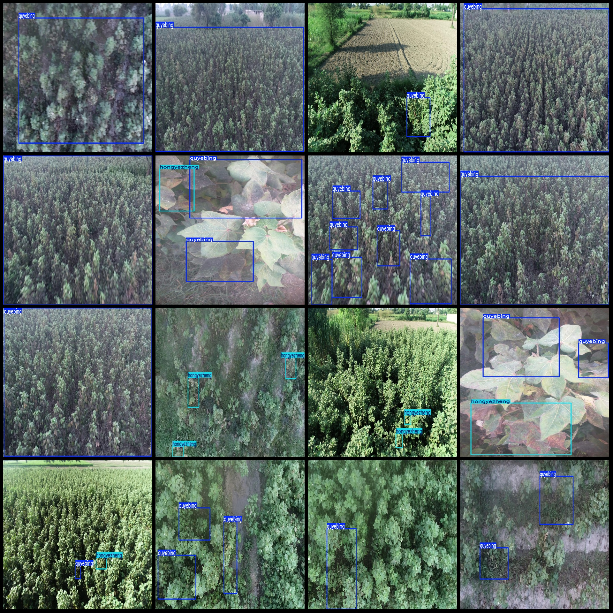
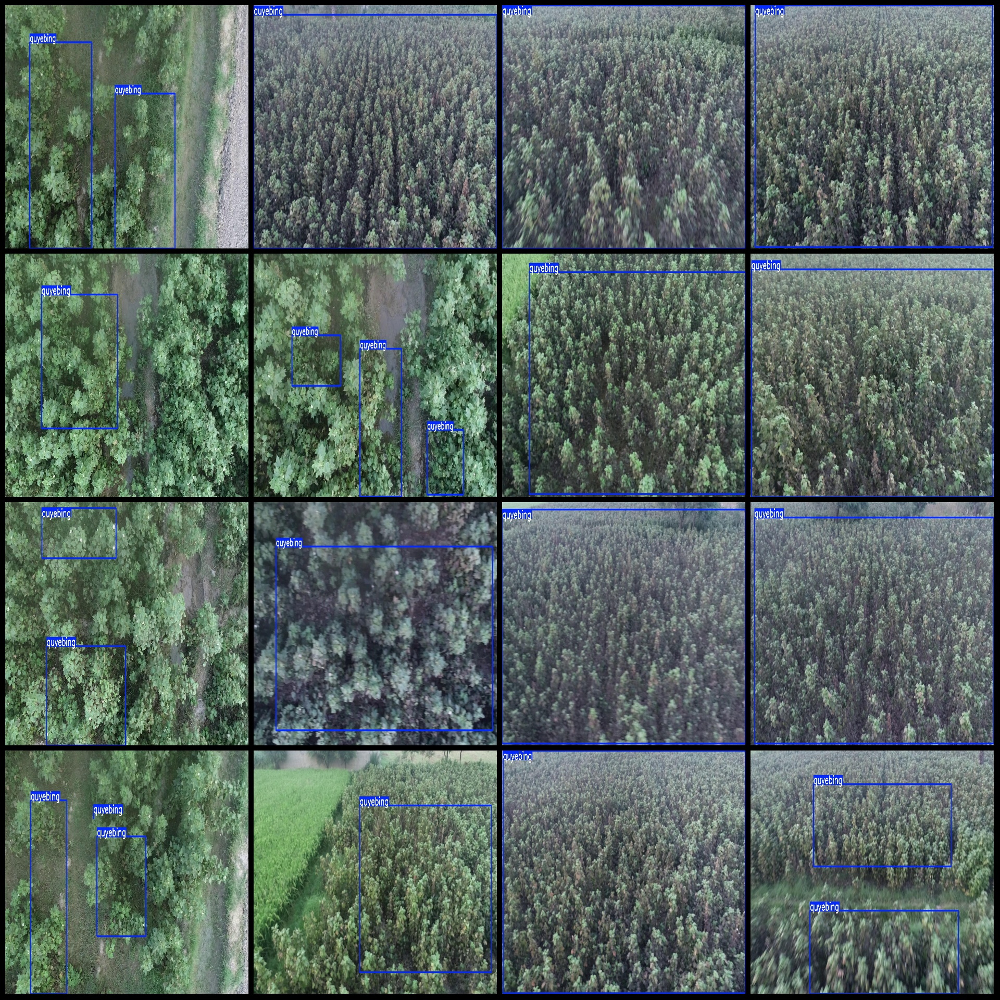

# Drone Perspective Cotton Yellow Dye and Red Spot Detection Dataset VOC+YOLO Format, 1173 Images in 2 Categories

Dataset format: Pascal VOC format + YOLO format (txt file without split path, only containing jpg images along with corresponding VOC format xml files and yolo format txt files)
Number of images (jpg file count): 1173
Number of annotations (xml file count): 1173
Number of annotations (txt file count): 1173
Number of annotation categories: 2
Annotation categories names (note that the order of categories in yolo format does not correspond to this, but is based on the labels folder classes.txt): ["hongyezheng", "quyebing"]
Number of bounding boxes per category:
hongyezheng (Red spot syndrome) = 228
quyebing (Curled leaf disease) = 1892
Total bounding boxes = 2120
Number of images per category:
hongyezheng (Red spot syndrome) = 143
quyebing (Curled leaf disease) = 1127
Image resolution: 1920x1080
Annotation tool used: labelImg
Annotation rule: Draw a rectangle around the category
Important note: The dataset does not have a training validation test set split; it needs to be divided by the user.
Special declaration: This dataset does not guarantee the accuracy of any trained models or weight files.
Image preview:
Annotation examples:

## Images

Here is a pay link on Stripe ( https://buy.stripe.com/3cs8yP7sY87d0vu9AB ). Please contact me lonlonago@foxmail.com after funding $89, and I will send you a complete data files , thank you!

